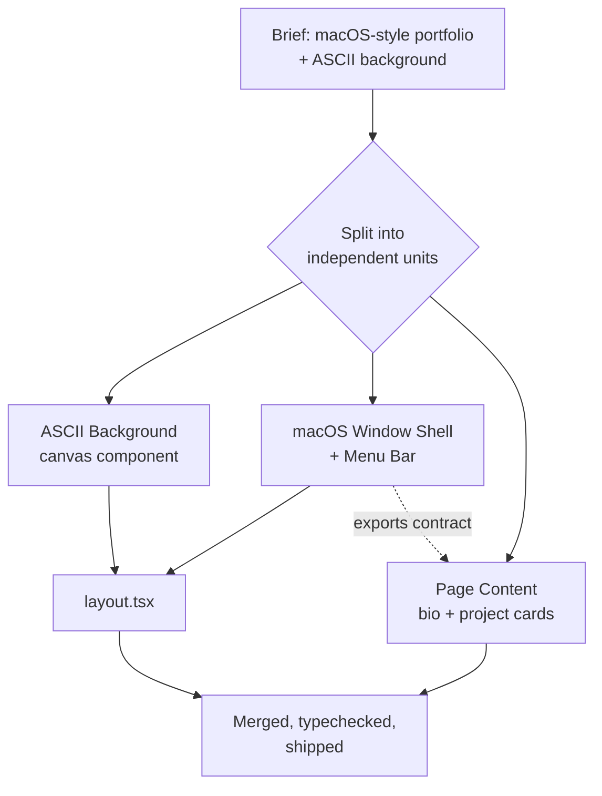

I rebuilt this site with three AI agents working at the same time, and the hardest part wasn't the code — it was the plan. If the plan is wrong, parallel agents don't fail faster, they fail in three different directions at once.

## Plan first, always

Before any agent touches a file, there's a plan: what gets built, in what order, and — critically — who owns which files. The plan isn't a vague description, it's closer to a dependency graph.



Notice the dotted line from the window shell to the content agent. That one matters more than the solid ones.

## The contract is the whole trick

Two agents can build at the same time only if neither has to wait on the other's output to know what to write. So before dispatch, I hand the content agent the *exact* shape of the component the shell agent hasn't built yet:

```ts
function MacWindow(props: {
  title?: string;
  children: React.ReactNode;
  className?: string;
  bodyClassName?: string;
}): JSX.Element
```

That's a promise, not code. The content agent imports `MacWindow` and writes against that signature as if it already exists. As long as the shell agent honors the contract, both branches converge without either one reading the other's file mid-flight.

If you want a formal way to think about it: three tasks $T_1, T_2, T_3$ can run in parallel iff their write-sets are disjoint —

$$
W(T_i) \cap W(T_j) = \emptyset \quad \forall i \neq j
$$

— and any read one task needs from another is satisfied by a contract fixed *before* dispatch, not by a live read of the other task's in-progress file. Violate that and you're not parallelizing, you're racing.

## What actually happened here

Three agents, three jobs, zero file collisions:

- **ascii-bg-builder** — a canvas-based animated ASCII/dither field, isolated in its own component, wired into `layout.tsx`
- **macos-shell-builder** — the window chrome and menu bar, plus the CSS keyframes for the traffic-light bits
- **content-builder** — bio, project cards, copy — consuming `MacWindow` purely from its documented props

Each one ran `tsc --noEmit` on its own slice before reporting back. The only real merge risk was `globals.css`, since two agents both needed to append to it — solved by telling both to *read fresh right before editing* instead of writing from a stale copy, so appends never clobber each other.

## Where it breaks

Parallelism isn't free. If two tasks need to read the same file *and* one of them is still deciding what to write there, you don't get speed — you get a coin flip on which version survives. The fix isn't "add more coordination," it's "cut the dependency before you start": fix contracts up front, keep write-sets disjoint, and let anything that genuinely can't be split run last, alone, on top of everything else.

That's the whole method. Plan hard enough that the parallel part is boring.
